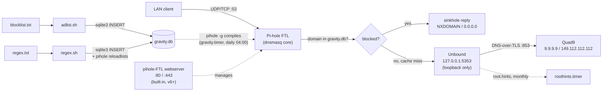

# Pi-hole + Unbound

Shell scripts that provision and maintain a self-hosted, network-wide DNS
ad-blocker: **Pi-hole** answers every DNS query on the LAN and sinkholes
ad/tracker domains, backed by **Unbound**, a validating recursive resolver
compiled from source on the same box, which forwards everything else to
Quad9 over DNS-over-TLS. Built for a Raspberry Pi running DietPi; the
scripts are plain `apt`/`systemd`-based Debian shell and should work on any
Debian-derived host.

There is no installer or Makefile — each script below is run by hand, as
root, in the order listed.

## Repository layout

```
pihole-unbound/
├── README.md
├── apt-upgrade.sh      # cross-cutting: not specific to either subsystem
├── deploy-units.sh     # cross-cutting: deploys files from both folders below
├── unbound/            # everything for the resolver
│   ├── unbound-setup.sh
│   ├── unbound-latest.sh
│   ├── unbound.conf
│   ├── unbound.service
│   ├── ulimit.sh
│   ├── roothints.sh
│   ├── roothints.service
│   └── roothints.timer
└── pihole/             # everything for the DNS server / ad-blocker
    ├── pihole-setup.sh
    ├── pihole-update.sh
    ├── adlist.sh
    ├── blocklist.txt
    ├── regex.sh
    ├── regex.txt
    ├── gravity.service
    └── gravity.timer
```

Grouped by subsystem, not by file type — a `.sh` and its matching
`.service`/`.timer` (e.g. `roothints.sh` + `roothints.service`) stay
next to each other rather than split across a `scripts/` and a
`systemd/` folder. No live systemd unit references a path inside this
repo (`unbound.service` and `roothints.service` both call deployed
copies under `/etc/unbound/`, not the repo) — moving files around here
only affects how you invoke scripts by hand, never the running system.

## How it works



Pi-hole (FTL) is the DNS server every device on the LAN talks to. It checks
each query against `/etc/pihole/gravity.db` and sinkholes matches; anything
else goes to Unbound, which only listens on loopback (`127.0.0.1:5353`) and
forwards upstream over DNS-over-TLS to Quad9. Blocklists and regex rules
are not managed through Pi-hole's own UI — `adlist.sh` reads URLs from the
local `blocklist.txt` and writes them into `gravity.db`'s `adlist` table;
`regex.sh` reads patterns from the local `regex.txt` and writes them into
`gravity.db`'s `domainlist` table (type `3`, deny/regex), then runs
`pihole reloadlists`. Both used to depend on an external GitLab repo
([kishansundar/pihole-adlist](https://gitlab.com/kishansundar/pihole-adlist))
— that repo is gone now; the source lists live in this repo instead.
`gravity.timer` runs `pihole -g` daily to recompile gravity from whatever
sources are already configured; it does not re-run `adlist.sh` itself,
so `blocklist.txt` changes still need a manual `adlist.sh` run.
`regex.sh` is manual-only too.

Pi-hole's upstream DNS server has to be pointed at `127.0.0.1#5353` for this
to work — that's set interactively during `pihole-setup.sh`'s call into
Pi-hole's own installer (or by hand in the admin UI). Nothing here verifies
it automatically.

## Prerequisites

- Debian-based host (developed against DietPi on a Raspberry Pi), run as
  `root`.
- A host with Pi-hole already installed (`pihole-setup.sh`) before running
  `deploy-units.sh` — see **Install order** below.
- Internet access for `apt`, GitHub, and `nlnetlabs.nl`. No longer needs
  GitLab — `adlist.sh`/`regex.sh` read local files now.

## Install order

```
./apt-upgrade.sh
./pihole/pihole-setup.sh
./unbound/unbound-setup.sh
./unbound/unbound-latest.sh
./deploy-units.sh
./pihole/adlist.sh
./pihole/pihole-update.sh
```

1. **`apt-upgrade.sh`** — `apt-get update && full-upgrade && autoremove && autoclean`.
2. **`pihole/pihole-setup.sh`** — installs `git build-essential wget`,
   clones `pi-hole/pi-hole`, runs its official installer
   (`basic-install.sh`). **Point Pi-hole's upstream DNS at
   `127.0.0.1#5353` here.**
3. **`unbound/unbound-setup.sh`** — creates the `unbound` system
   user/group (uid/gid 88) and installs its build dependencies.
4. **`unbound/unbound-latest.sh`** — downloads, builds, and installs
   Unbound 1.26.0 from source, fetches root hints and the DNSSEC trust
   anchor, runs `unbound-control-setup`. Also deploys
   `unbound.conf`/`unbound.service`/`ulimit.sh` itself (see **State of
   this repo**).
5. **`deploy-units.sh`** — installs everything else tracked here:
   `unbound/roothints.sh`/`.service`/`.timer` and
   `pihole/gravity.service`/`.timer`, enables both timers. Safe to
   re-run any time.
6. **`pihole/adlist.sh`** — reads `blocklist.txt` (tracked alongside it)
   and loads its URLs into `gravity.db`.
7. **`pihole/pihole-update.sh`** — `pihole -up` then `pihole -g -f`.

`post-install.sh`, which used to handle all of this deployment in one
step, was removed earlier — `unbound-latest.sh` and `deploy-units.sh`
between them now cover what it did for `unbound.conf`/`.service` and the
timers, but not the `pihole-FTL.conf`/`dnsmasq`/`/etc/hosts` tweaks it
also used to make. Those aren't tracked or reapplied by anything here.

## State of this repo

Every config file and systemd unit this toolkit needs is tracked in
`unbound/` or `pihole/` (see **Repository layout** above) — and
**`deploy-units.sh` installs all of it**: copies each file to its live
location with the right owner/mode, backs up an existing
`/etc/unbound/unbound.conf` first (timestamped `.bak`), reloads systemd,
enables both timers, and enables (but doesn't force-restart)
`unbound.service`. Safe to re-run any time — every step is idempotent,
and it never restarts a running `unbound.service` or triggers an
unplanned `gravity`/`roothints` run.

Two things it deliberately does *not* cover:

- **`pihole-FTL.conf`/`dnsmasq`/`/etc/hosts` tweaks** — `post-install.sh`
  used to make these (disabling dnsmasq's own cache, `MAXDBDAYS`, host
  aliases); it was removed and nothing replaces that part. Config drift
  there wouldn't be caught by `deploy-units.sh`.
- **`cleanup.sh`/`.service`/`.timer`** — removed entirely, not tracked,
  not deployed. The weekly log-truncation/cache-flush pass doesn't run
  on any schedule or by hand anymore; system logs are still covered by
  `logrotate` independently, so this matters less than it sounds.

`roothints.service` calls the *deployed* `/etc/unbound/roothints.sh`,
not a repo path — same reasoning as `ulimit.sh`: neither script depends
on anything else in the repo, so neither should break if the repo's own
location ever changes again (as it did once already this session).
`roothints.sh` itself fixes a real bug the original `roothints.service`
had: it used to run a bare `curl -o /etc/unbound/root.hints ...`
directly, so a failed or truncated fetch would clobber the file in
place — and since `unbound.conf` now has no forward-zone fallback,
`root.hints` is the only path left to resolution. `roothints.sh`
downloads to a temp file first and only replaces the live file if the
result looks valid.

`gravity.service`/`.timer` recreate the daily 04:00 automatic `pihole -g`
gravity rebuild that used to be `pihole.service`/`.timer` (untracked,
removed earlier this session) — same behavior, renamed to avoid sitting
confusingly next to the real `pihole-FTL.service` (easy to mistake "is
Pi-hole running?" for "did gravity update?"). It deliberately does *not*
also run `adlist.sh` — just the gravity recompile against whatever's
already configured; new `blocklist.txt` URLs still need a manual
`adlist.sh` run before this timer picks them up. Verified with a real
run: 2,403,280 gravity domains compiled from the 15 sources in
`blocklist.txt` plus the 14 regex filters in `regex.txt`.

`adlist.sh`/`regex.sh` both used to depend on an external GitLab repo
([kishansundar/pihole-adlist](https://gitlab.com/kishansundar/pihole-adlist),
now deleted) — both read local files (`blocklist.txt`, `regex.txt`) in
this repo instead, no network dependency for the source lists themselves.

## Script reference

| Script | Runs | Purpose |
|---|---|---|
| `apt-upgrade.sh` | install, ad hoc | System package update/upgrade/cleanup. |
| `pihole/pihole-setup.sh` | install once | Installs Pi-hole via its own official installer. |
| `unbound/unbound-setup.sh` | install once | Creates the `unbound` user/group, installs build deps. |
| `unbound/unbound-latest.sh` | install / version bumps | Builds and installs Unbound 1.26.0 from source; deploys `unbound.conf`/`.service`/`ulimit.sh`. |
| `deploy-units.sh` | install, and after editing any tracked unit/config | Installs `unbound/roothints.*` and `pihole/gravity.*` to `/etc`, enables both timers. Idempotent. |
| `pihole/adlist.sh` | recurring, manual | Loads `blocklist.txt`'s URLs into `gravity.db`'s `adlist` table. |
| `pihole/regex.sh` | recurring, manual | Loads `regex.txt`'s patterns into `gravity.db`'s `domainlist` table (type `3`), then `pihole reloadlists`. |
| `pihole/pihole-update.sh` | recurring, manual | Updates Pi-hole core and force-rebuilds gravity. |
| `unbound/ulimit.sh` | on every Unbound start, via `unbound.service`'s `ExecStartPre` | Kernel network-buffer/TCP tuning (`sysctl -w`). |
| `unbound/roothints.sh` | monthly, via `roothints.timer`, deployed to `/etc/unbound/roothints.sh` | Safely refreshes `/etc/unbound/root.hints` (temp file + validation before replacing). |

## Maintenance

Automatic, via systemd timers tracked in this repo:

- **`roothints.timer`** — monthly → `roothints.sh` safely refreshes
  `/etc/unbound/root.hints` (temp file + validation, won't clobber the
  existing file on a failed fetch).
- **`gravity.timer`** — daily, 04:00 (±15m) → `pihole -g` rebuilds
  gravity from whatever sources are already configured. Does **not**
  re-run `adlist.sh` — new `blocklist.txt` URLs still need a manual run
  before this timer will pick them up.

Manual only, nothing schedules these:

- Blocklist source refresh (`adlist.sh`, from `blocklist.txt`)
- Regex denylist refresh (`regex.sh`, from `regex.txt`)
- Pi-hole core updates (`pihole-update.sh`)
- Unbound version upgrades (`unbound-latest.sh`)
- Log/cache housekeeping — used to run weekly via `cleanup.timer` →
  `cleanup.sh`; both are gone. In practice this matters less than it
  sounds: `/var/log`'s system logs are already handled by `logrotate`
  independently of anything in this repo.
- DNSSEC trust anchor refresh (only happens as a side effect of
  re-running `unbound-latest.sh`)
