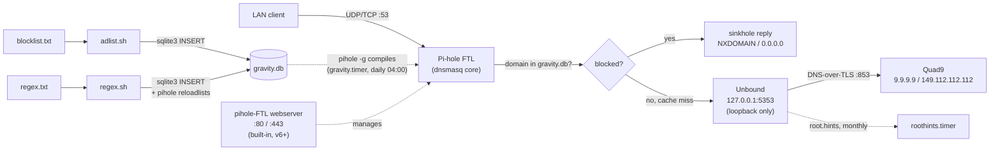

# Pi-hole + Unbound

Shell scripts that provision and maintain a self-hosted, network-wide DNS
ad-blocker: **Pi-hole** answers every DNS query on the LAN and sinkholes
ad/tracker domains, backed by **Unbound**, a validating recursive resolver
compiled from source on the same box, which forwards everything else to
Quad9 over DNS-over-TLS. Built for a Raspberry Pi running DietPi; the
scripts are plain `apt`/`systemd`-based Debian shell and should work on any
Debian-derived host.

There is no installer or Makefile — each script below is run by hand, as
root, in the order listed.

## How it works



Pi-hole (FTL) is the DNS server every device on the LAN talks to. It checks
each query against `/etc/pihole/gravity.db` and sinkholes matches; anything
else goes to Unbound, which only listens on loopback (`127.0.0.1:5353`) and
forwards upstream over DNS-over-TLS to Quad9. Blocklists and regex rules
are not managed through Pi-hole's own UI — `adlist.sh` reads URLs from the
local `blocklist.txt` and writes them into `gravity.db`'s `adlist` table;
`regex.sh` reads patterns from the local `regex.txt` and writes them into
`gravity.db`'s `domainlist` table (type `3`, deny/regex), then runs
`pihole reloadlists`. Both used to depend on an external GitLab repo
([kishansundar/pihole-adlist](https://gitlab.com/kishansundar/pihole-adlist))
— that repo is gone now; the source lists live in this repo instead.
`gravity.timer` runs `pihole -g` daily to recompile gravity from whatever
sources are already configured; it does not re-run `adlist.sh` itself,
so `blocklist.txt` changes still need a manual `adlist.sh` run.
`regex.sh` is manual-only too.

Pi-hole's upstream DNS server has to be pointed at `127.0.0.1#5353` for this
to work — that's set interactively during `pihole-setup.sh`'s call into
Pi-hole's own installer (or by hand in the admin UI). Nothing here verifies
it automatically.

## Prerequisites

- Debian-based host (developed against DietPi on a Raspberry Pi), run as
  `root`.
- A host that already has the systemd units enabled and running (see
  **State of this repo** below) — `unbound.conf`/`unbound.service` are
  tracked in this repo again, but nothing here deploys them to `/etc` or
  reloads systemd.
- Internet access for `apt`, GitHub, and `nlnetlabs.nl`. No longer needs
  GitLab — `adlist.sh`/`regex.sh` read local files now.

## Install order

```
./apt-upgrade.sh
./pihole-setup.sh
./unbound-setup.sh
./unbound-latest.sh
./adlist.sh
./pihole-update.sh
```

1. **`apt-upgrade.sh`** — `apt-get update && full-upgrade && autoremove && autoclean`.
2. **`pihole-setup.sh`** — installs `git build-essential wget`, clones
   `pi-hole/pi-hole`, runs its official installer (`basic-install.sh`).
   **Point Pi-hole's upstream DNS at `127.0.0.1#5353` here.**
3. **`unbound-setup.sh`** — creates the `unbound` system user/group
   (uid/gid 88) and installs its build dependencies.
4. **`unbound-latest.sh`** — downloads, builds, and installs Unbound
   1.26.0 from source, fetches root hints and the DNSSEC trust anchor,
   runs `unbound-control-setup`.
5. **`adlist.sh`** — reads `blocklist.txt` (tracked in this repo) and
   loads its URLs into `gravity.db`.
6. **`pihole-update.sh`** — `pihole -up` then `pihole -g -f`.

There is no longer a script that deploys `unbound.conf`/the systemd units,
sets `pihole-FTL.conf`/`dnsmasq`/`/etc/hosts`, or enables/restarts
`unbound`/`roothints.timer` — that was `post-install.sh`, removed. On a
host where those units are already installed and enabled (true of the
currently-provisioned box), nothing above needs it. On a fresh host, none
of that setup happens unless you do it by hand or restore the script —
see below.

## State of this repo

`unbound.conf` and `unbound.service` are tracked in this repo again (as
plain files at the repo root, matching the live `/etc/unbound/unbound.conf`
and `/etc/systemd/system/unbound.service` exactly) — but **no script
deploys, enables, or reloads them.** `conf/`, `services/`, and
`post-install.sh` (which used to do that copying) were removed earlier and
haven't been restored. The currently-provisioned host works because those
files are already live under `/etc/systemd/system` and `/etc/unbound` from
before; a fresh clone onto a new host would need them copied into place
and `systemctl daemon-reload && systemctl enable --now unbound` run by
hand — nothing here does it automatically. `cleanup.service`/`.timer` are
still not tracked here at all.

`roothints.service`/`.timer` and `roothints.sh` are tracked now too.
`roothints.service` used to run a bare `curl -o /etc/unbound/root.hints
...` directly — the same unprotected-overwrite bug that was fixed in
`unbound-latest.sh` earlier (a failed/truncated fetch would clobber the
only path left to resolution, since there's no forward-zone fallback).
Fixed the same way here: `roothints.sh` downloads to a temp file first
and only replaces the live file if the result looks valid.
`roothints.service` calls `/etc/unbound/roothints.sh` (a deployed copy,
not the repo path) — same reasoning as `ulimit.sh`: this script has no
dependency on anything else in the repo, so it shouldn't break if the
repo's own path ever changes again.

`cleanup.sh`, `cleanup.service`, and `cleanup.timer` have all been removed
— the weekly log-truncation/cache-flush/service-restart maintenance pass
no longer runs, on any schedule or by hand. Neither this nor anything
below touches `pihole-FTL.service`, the actual DNS-resolving daemon
installed by Pi-hole itself — that's untouched and has been running the
whole time.

The daily 04:00 automatic `pihole -g` gravity rebuild — originally
`pihole.service`/`.timer`, untracked, removed earlier this session — is
back as **`gravity.service`/`.timer`**: same content (a oneshot
`pihole -g` triggered daily), tracked in the repo this time, and
renamed because `pihole.service` sitting next to the real
`pihole-FTL.service` was confusing — easy to mistake one for "is
Pi-hole running?" and the other for "did gravity update?" `roothints`
already used this naming style (named after what it refreshes, no
`pihole-`/`unbound-` prefix needed since it's unambiguous), so `gravity`
follows the same convention. `pihole-update.sh` still does the same
`pihole -g` call too, manually, for when you also want to update
Pi-hole core at the same time (`pihole -up`).

**Blocklist and regex sources moved local.** `adlist.sh` used to fetch its
URL list from an external GitLab repo
([kishansundar/pihole-adlist](https://gitlab.com/kishansundar/pihole-adlist))
over the network; that repo has been deleted, and `adlist.sh` now reads
`blocklist.txt` in this repo instead — no network dependency for the list
itself, no external single point of failure. `regex.txt` (Pi-hole regex
denylist patterns) and `regex.sh` (loads them into `gravity.db`'s
`domainlist` table, type `3`, then runs `pihole reloadlists`) are new,
tracked here for the first time.

**Gravity rebuild is automatic again**, via the recreated
`gravity.timer` above — daily at 04:00 (±15m), just `pihole -g` against
whatever's already configured. Verified with a real manual run:
2,403,280 gravity domains compiled successfully from the 15 sources in
`blocklist.txt` plus the 14 regex filters from `regex.txt`.

## Script reference

| Script | Runs | Purpose |
|---|---|---|
| `apt-upgrade.sh` | install, ad hoc | System package update/upgrade/cleanup. |
| `pihole-setup.sh` | install once | Installs Pi-hole via its own official installer. |
| `unbound-setup.sh` | install once | Creates the `unbound` user/group, installs build deps. |
| `unbound-latest.sh` | install / version bumps | Builds and installs Unbound 1.26.0 from source. |
| `adlist.sh` | recurring, manual | Loads `blocklist.txt`'s URLs into `gravity.db`'s `adlist` table. |
| `regex.sh` | recurring, manual | Loads `regex.txt`'s patterns into `gravity.db`'s `domainlist` table (type `3`), then `pihole reloadlists`. |
| `pihole-update.sh` | recurring, manual | Updates Pi-hole core and force-rebuilds gravity. |
| `ulimit.sh` | on every Unbound start, via `unbound.service`'s `ExecStartPre` | Kernel network-buffer/TCP tuning (`sysctl -w`). |
| `roothints.sh` | monthly, via `roothints.timer`, deployed to `/etc/unbound/roothints.sh` | Safely refreshes `/etc/unbound/root.hints` (temp file + validation before replacing). |

## Maintenance

Automatic, via systemd timers tracked in this repo:

- **`roothints.timer`** — monthly → `roothints.sh` safely refreshes
  `/etc/unbound/root.hints` (temp file + validation, won't clobber the
  existing file on a failed fetch).
- **`gravity.timer`** — daily, 04:00 (±15m) → `pihole -g` rebuilds
  gravity from whatever sources are already configured. Does **not**
  re-run `adlist.sh` — new `blocklist.txt` URLs still need a manual run
  before this timer will pick them up.

Manual only, nothing schedules these:

- Blocklist source refresh (`adlist.sh`, from `blocklist.txt`)
- Regex denylist refresh (`regex.sh`, from `regex.txt`)
- Pi-hole core updates (`pihole-update.sh`)
- Unbound version upgrades (`unbound-latest.sh`)
- Log/cache housekeeping — used to run weekly via `cleanup.timer` →
  `cleanup.sh`; both are gone. In practice this matters less than it
  sounds: `/var/log`'s system logs are already handled by `logrotate`
  independently of anything in this repo.
- DNSSEC trust anchor refresh (only happens as a side effect of
  re-running `unbound-latest.sh`)
