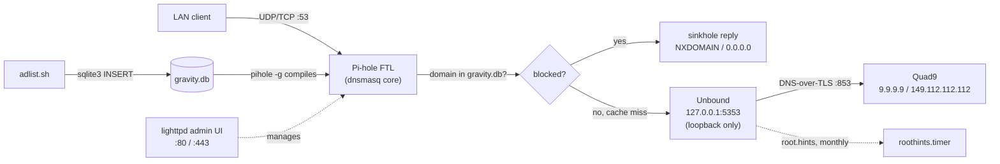

# Pi-hole + Unbound

Shell scripts that provision and maintain a self-hosted, network-wide DNS
ad-blocker: **Pi-hole** answers every DNS query on the LAN and sinkholes
ad/tracker domains, backed by **Unbound**, a validating recursive resolver
compiled from source on the same box, which forwards everything else to
Quad9 over DNS-over-TLS. Built for a Raspberry Pi running DietPi; the
scripts are plain `apt`/`systemd`-based Debian shell and should work on any
Debian-derived host.

There is no installer or Makefile — each script below is run by hand, as
root, in the order listed.

## How it works



Pi-hole (FTL) is the DNS server every device on the LAN talks to. It checks
each query against `/etc/pihole/gravity.db` and sinkholes matches; anything
else goes to Unbound, which only listens on loopback (`127.0.0.1:5353`) and
forwards upstream over DNS-over-TLS to Quad9. Blocklists are not managed
through Pi-hole's own UI — `adlist.sh` writes them directly into
`gravity.db` via `sqlite3` from a URL list hosted at
[kishansundar/pihole-adlist](https://gitlab.com/kishansundar/pihole-adlist).

Pi-hole's upstream DNS server has to be pointed at `127.0.0.1#5353` for this
to work — that's set interactively during `pihole-setup.sh`'s call into
Pi-hole's own installer (or by hand in the admin UI). Nothing here verifies
it automatically.

## Prerequisites

- Debian-based host (developed against DietPi on a Raspberry Pi), run as
  `root`.
- A host that already has the systemd units and `unbound.conf` in place
  (see **State of this repo** below) — nothing here installs or enables
  them anymore.
- Internet access for `apt`, GitHub/GitLab, and `nlnetlabs.nl`.

## Install order

```
./apt-upgrade.sh
./pihole-setup.sh
./unbound-setup.sh
./unbound-latest.sh
./adlist.sh
./pihole-update.sh
./cleanup.sh
```

1. **`apt-upgrade.sh`** — `apt-get update && full-upgrade && autoremove && autoclean`.
2. **`pihole-setup.sh`** — installs `git build-essential wget`, clones
   `pi-hole/pi-hole`, runs its official installer (`basic-install.sh`).
   **Point Pi-hole's upstream DNS at `127.0.0.1#5353` here.**
3. **`unbound-setup.sh`** — creates the `unbound` system user/group
   (uid/gid 88) and installs its build dependencies.
4. **`unbound-latest.sh`** — downloads, builds, and installs Unbound
   1.26.0 from source, fetches root hints and the DNSSEC trust anchor,
   runs `unbound-control-setup`.
5. **`adlist.sh`** — fetches the blocklist-URL list and loads it into
   `gravity.db`.
6. **`pihole-update.sh`** — `pihole -up` then `pihole -g -f`.
7. **`cleanup.sh`** — first maintenance pass: log truncation, cache
   flush, service restart.

There is no longer a script that deploys `unbound.conf`/the systemd units,
sets `pihole-FTL.conf`/`dnsmasq`/`/etc/hosts`, or enables/restarts the
`unbound`, `pihole.timer`, `roothints.timer`, `cleanup.timer` services —
that was `post-install.sh`, removed. On a host where those units are
already installed and enabled (true of the currently-provisioned box),
nothing above needs it. On a fresh host, none of that setup happens unless
you do it by hand or restore the script — see below.

### Lighttpd HTTPS (manual, optional)

```
mkdir /etc/lighttpd/certs
openssl req -x509 -nodes -days 7300 -newkey rsa:2048 -sha256 \
  -keyout /etc/lighttpd/certs/server.pem -out /etc/lighttpd/certs/server.pem
chmod 600 /etc/lighttpd/certs/server.pem
```

Add `mod_openssl` to `server.modules` in `/etc/lighttpd/lighttpd.conf`, then:

```
$SERVER["socket"] == ":443" {
    ssl.engine = "enable"
    ssl.pemfile = "/etc/lighttpd/certs/server.pem"
}
```

```
sudo systemctl restart lighttpd
```

## State of this repo

This repo does **not** contain the systemd unit files (`unbound.service`,
`pihole.service`/`.timer`, `roothints.service`/`.timer`,
`cleanup.service`/`.timer`), `unbound.conf`, or a script to deploy,
enable, or reload any of them — `conf/`, `services/`, and `post-install.sh`
were all removed. The currently-provisioned host still has those units
installed, enabled, and running under `/etc/systemd/system` and
`/etc/unbound` from before, which is the only reason this toolkit still
works today. **A fresh clone onto a new host has no path to a working
install** — the unit files, `unbound.conf`, and the config/enable step all
need to be recreated by hand or recovered from git history
(`git log --all -- '*.service' '*.timer' conf/unbound.conf post-install.sh`)
before any of the scripts above will have something to run against.

## Script reference

| Script | Runs | Purpose |
|---|---|---|
| `apt-upgrade.sh` | install, ad hoc | System package update/upgrade/cleanup. |
| `pihole-setup.sh` | install once | Installs Pi-hole via its own official installer. |
| `unbound-setup.sh` | install once | Creates the `unbound` user/group, installs build deps. |
| `unbound-latest.sh` | install / version bumps | Builds and installs Unbound 1.26.0 from source. |
| `adlist.sh` | recurring, manual | Loads the blocklist URL list into `gravity.db`. |
| `pihole-update.sh` | recurring, manual | Updates Pi-hole core and force-rebuilds gravity. |
| `cleanup.sh` | weekly, via `cleanup.timer` | Truncates logs, flushes Pi-hole's cache, restarts `pihole-FTL`/`unbound`. |
| `ulimit.sh` | on every Unbound start, via `unbound.service`'s `ExecStartPre` | Kernel network-buffer/TCP tuning (`sysctl -w`). |

## Maintenance

Automatic, via systemd timers already installed on the host:

- **`pihole.timer`** — daily 04:00 (±15 min) → `pihole -g`, recompiles
  gravity from whatever lists are already in `gravity.db`. Does **not**
  re-fetch the URL list from GitLab.
- **`roothints.timer`** — monthly → re-`curl`s `named.cache` into
  `/etc/unbound/root.hints`.
- **`cleanup.timer`** — weekly → runs `cleanup.sh`.

Manual only, nothing schedules these:

- Blocklist source refresh (`adlist.sh`)
- Pi-hole core updates (`pihole-update.sh`)
- Unbound version upgrades (`unbound-latest.sh`)
- DNSSEC trust anchor refresh (only happens as a side effect of
  re-running `unbound-latest.sh`)
